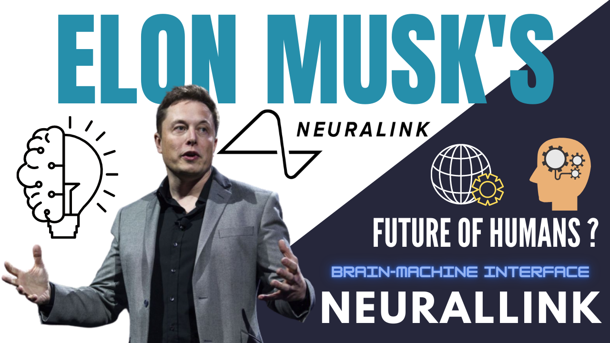

# Elon_Musk_Neurallink

We Learn and Grow Together.

## Elon Musk CEO of SpaceX and Tesla, Created Neuralink, a Neurological Company that is Developing ultra-high bandwidth brain-machine interfaces to connect humans and computers.
### Neuralink has three stated Goals: 
1. Treating brain disorders and helping people who had accidents.
2. Creating a brain-machine interface.
3. Building toward a potential symbiosis with artificial intelligence. 
The first of those Goals is the most Realistic in the Short-Term.
Musk's Neurallink is hoping to help solve major neurological issues. 

In Long-Term, Elon Musk said Neuralink will help to achieve a sort of symbiosis with Artificial Intelligence.

I also Explain how, Neuralink works with, How it Installed and Achieve the Success.
Shortly Explain, Electrodes read and write brain data. Neuralink is designing its electrodes not just to "read" from neurons what's going on in the brain, but also to "write" signals into the brain. "You can use this technology in the brain to restore a sense of touch or vision", Just like Matrix Movie Series.

### Watch the Full Video to Feel the Futurist View of Technology and Science.

**Follow me on Instagram and Facebook to get Updates on Projects and Ideas that We are Working On !!
Instagram - https://bit.ly/3jLR8vY
Telegram - https://bit.ly/30bstcE

🔴Next Project - Data Analysis with Data Visualization along with Machine Learning Basic Algorithms from Scratch. Dashboard with Plotly Dash will Build for Data Visualization.

**The More You Analyze, the More You Get Insights from the Data.
 
### Connect with us:

